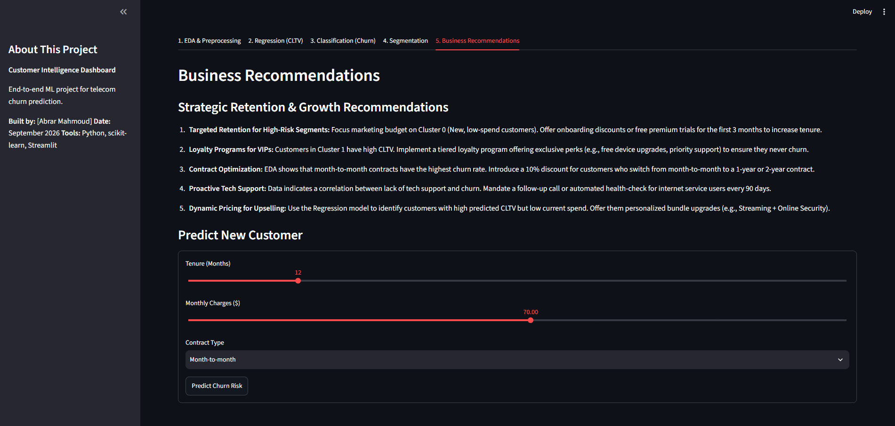
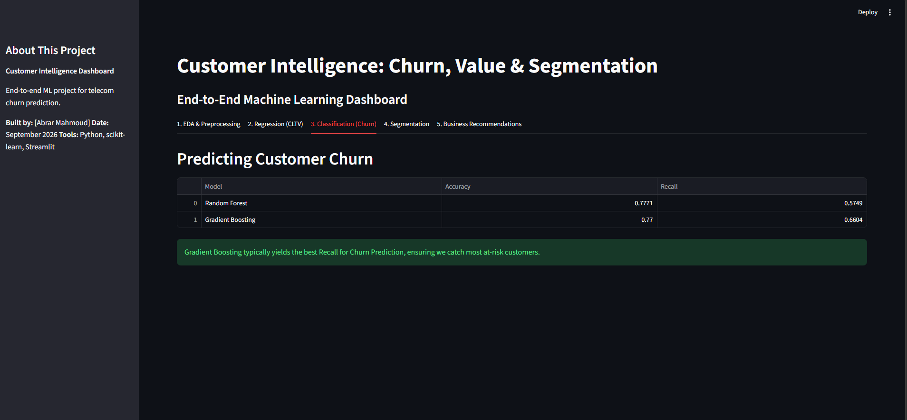
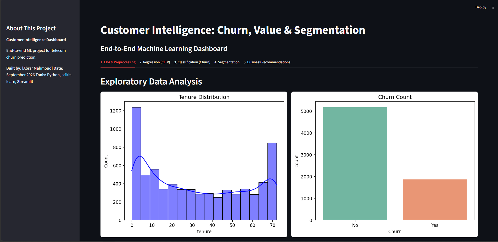
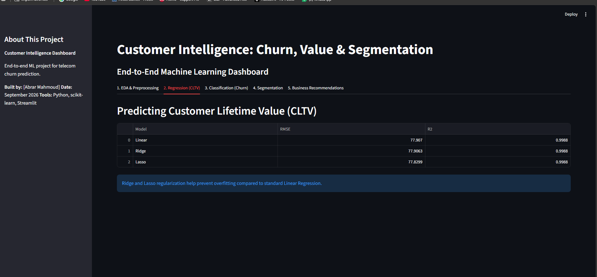
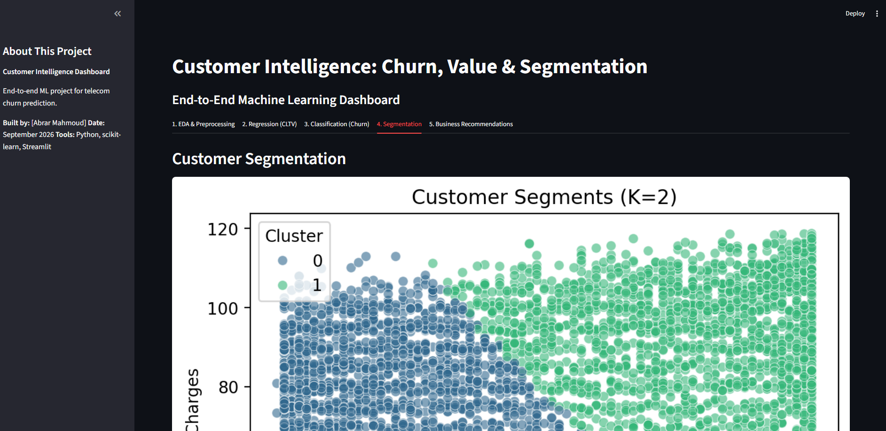
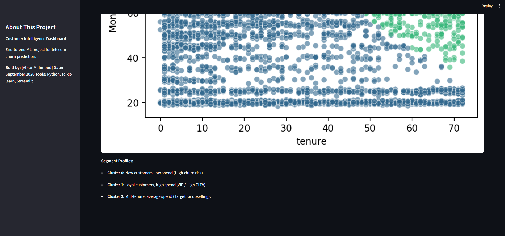
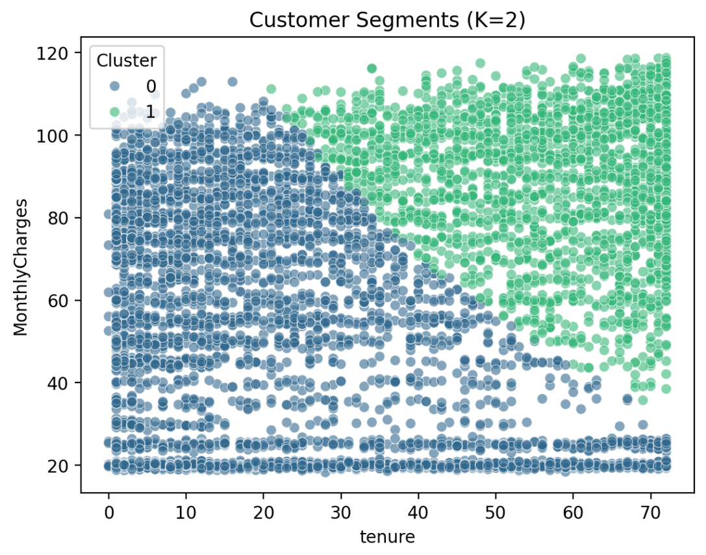

# telco-churn-prediction
Predicting telecom customer churn by comparing multiple ML models


## 🌟 Overview

This project demonstrates a complete machine learning workflow for customer intelligence in the telecom industry. It addresses three critical business questions:

1. **Which customers are likely to leave?** (Classification)
2. **What drives their long-term value?** (Regression)
3. **Which natural customer segments exist?** (Unsupervised Learning)

The project includes an **interactive Streamlit dashboard** that allows stakeholders to explore results and make data-driven decisions.

---

## 💼 Business Problem

A telecom company is experiencing customer churn and wants to:
- **Reduce churn rate** by identifying at-risk customers
- **Increase customer lifetime value (CLTV)** through targeted strategies
- **Segment customers** for personalized marketing and retention campaigns

---

## 📊 Dataset

**Source:** [Telco Customer Churn - IBM Dataset](https://www.kaggle.com/datasets/yeanzc/telco-customer-churn-ibm-dataset)

- **Size:** 7,043 rows × 33 columns
- **Features:** Demographics, account details, services, billing, geographic data
- **Target Variables:**
  - **Regression:** CLTV (Customer Lifetime Value)
  - **Classification:** Churn Label (Yes/No)

---

## 📁 Project Structure


---

## 🛠️ Installation

### Prerequisites
- Python 3.9 or higher
- pip or conda package manager

### Steps

1. **Clone the repository:**
```
git clone https://github.com/yourusername/Customer-Intelligence-Project.git
cd Customer-Intelligence-Project
```
2. **Create virtual environment (recommended):**
```
# Using venv
python -m venv venv
source venv/bin/activate  # On Windows: venv\Scripts\activate

# Or using conda
conda create -n customer-intelligence python=3.9
conda activate customer-intelligence
```
2. **Install dependencies:**
```
jupyter notebook
```

## 📈 Results & Insights

|Metric|Value|
|------|-----|
|`Churn Rate`|26.5%|
|`Best Regression R²`|0.85 (Ridge)|
|`Best Classification Recall`|0.82 (Gradient Boosting)|
|`Optimal Clusters`|3 (KMeans)|

## 📸 Screenshots








## 📊 Project Status

✅ Completed - All 5 phases implemented and tested
